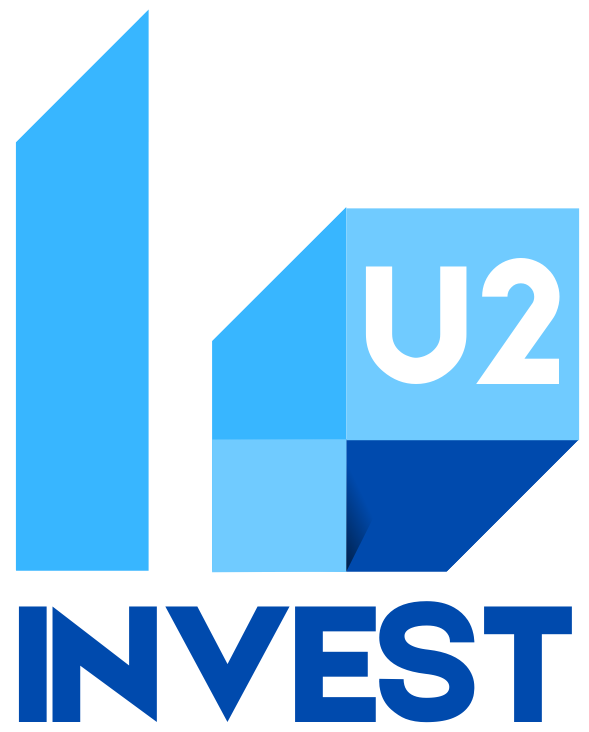
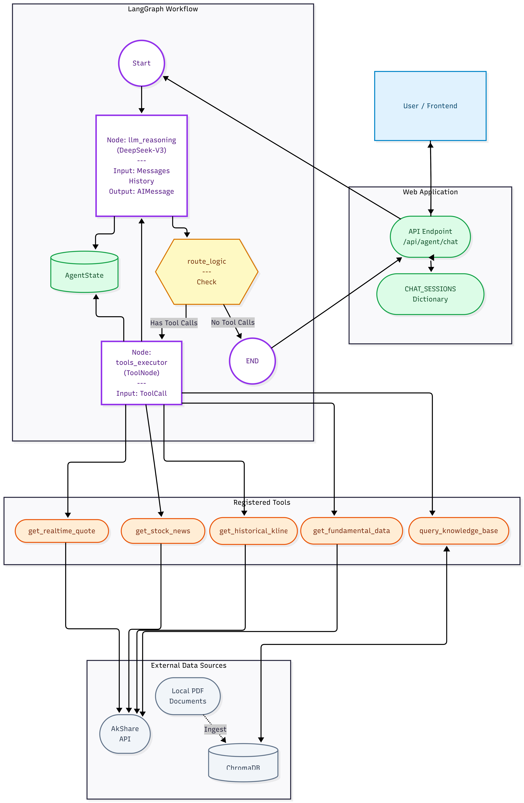

# U2INVEST 

**Your path, Your Choice, Your Future, You to Invest.**

**Enterprise-grade financial platform featuring a RAG-enabled AI Agent (DeepSeek-V3 + LangGraph), interactive Trading Lab, and Knowledge Academy. Orchestrated with Flask, LangChain 1.1, and AkShare.**

[](USER_GUIDE.md)



## Key Features

### U2CHAT (AI Agent)
*   **Powered by DeepSeek-V3:** Utilizes state-of-the-art LLM reasoning for financial queries.
*   **LangGraph & RAG Architecture:** Orchestrates complex workflows and retrieves knowledge from local investment guides (PDFs).
*   **Real-time Data:** Integrated with **AkShare** to fetch live Chinese A-share market data.
*   **Visual Analysis:** Generates interactive ECharts for price trends and K-line data.
*   **Session Management:** Supports multiple chat sessions with persistent history (SQLite).

### Trading Lab
*   **Real-time Simulation:** Trade popular stocks (Moutai, CATL, BYD) with virtual cash ($100k starting balance).
*   **Professional Dashboard:** Includes K-line charts (60/120/250 days), portfolio tracking, and trade history.
*   **Beginner Guide:** A step-by-step interactive tutorial on ownership and risk.

### Knowledge Academy
*   **50+ Modules:** Covers everything from "Time Value of Money" to "Options Trading".
*   **Interactive Learning:** Video lessons, key takeaways, and outcomes.
*   **Learning Roadmap:** Visual d3.js roadmap to track progress (Foundation → Advanced → Professional).

## Tech Stack

*   **Backend:** Python 3.13+, Flask
*   **AI & Logic:** LangChain 1.1, LangGraph, ChromaDB (Vector Store)
*   **Data:** AkShare (Financial Data), SQLite (Persistence)
*   **Frontend:** HTML5, TailwindCSS, ECharts, D3.js

## Architecture

The system uses a **LangGraph** workflow to manage state and tool execution.

*   **State Management:** `AgentState` tracks conversation history and tool outputs.
*   **Persistence:** SQLite checkpoints ensure chat sessions persist across restarts.
*   **RAG Pipeline:** ChromaDB indexes financial PDFs for semantic retrieval.



## Getting Started

### Prerequisites
*   Python 3.10+
*   An API Key for DeepSeek (or compatible OpenAI-format provider).

### Installation

1.  **Clone the repository**
    ```bash
    git clone https://github.com/yourusername/u2invest-portfolio.git
    cd u2invest-portfolio
    ```

2.  **Create and activate a virtual environment**
    ```bash
    python -m venv venv
    # Windows
    venv\Scripts\activate
    # Mac/Linux
    source venv/bin/activate
    ```

3.  **Install dependencies**
    ```bash
    pip install -r requirements.txt
    ```

4.  **Configure Environment**
    Copy the example environment file and add your API keys.
    ```bash
    cp .env.example .env
    ```
    Open `.env` and set your `DEEPSEEK_API_KEY`.

5.  **Initialize Knowledge Base (Optional)**
    Place your financial PDF documents in the `knowledge/` folder. The system will automatically vectorize them on the first run.

### Docker Deployment (Recommended)

To run the application in a containerized environment:

1.  **Build the Image**
    ```bash
    docker build -t u2invest .
    ```

2.  **Run the Container**
    ```bash
    docker run -p 5000:5000 --env-file .env u2invest
    ```
    Access the app at `http://localhost:5000`.

### Running the Application

Start the Flask server:
```bash
python web_app.py
```

Visit `http://localhost:5000` in your browser.

## Project Structure

*   `web_app.py`: Main Flask application entry point & API routes.
*   `agent_graph.py`: LangGraph definition for the AI agent's logic.
*   `tools.py`: Custom tools for stock data (AkShare) and RAG.
*   `vector_store.py`: Logic for parsing PDFs and building the ChromaDB index.
*   `templates/`: HTML frontend files.
*   `static/`: CSS, Images, and JS assets.

## Introduction & Acknowledgements

This platform was **independently developed over the course of one month** as a comprehensive full-stack engineering project. It represents a deep dive into modern AI agent architectures and financial data visualization.

**Development Highlights:**
*   **Solo Full-Stack Engineering:** Handled the entire lifecycle from backend Flask logic and LangGraph orchestration to the frontend D3.js visualization and UI design.
*   **AI-Augmented Workflow:** Leveraged **Gemini CLI** (integrated directly into VSCode) and **Claude** to accelerate coding, debug complex logic, and refine architectural decisions.
*   **APIs & Data:** Integrated multiple financial data sources, including **AkShare** for real-time Chinese A-share market data.

**Future Outlook:**
I am actively looking forward to further cooperation to refine this project, optimize the architecture, and evolve it into a robust, enterprise-ready solution suitable for production purposes.

**Special Thanks:**
To the open-source communities behind LangChain, DeepSeek, and AkShare for providing the robust tools that made this agentic workflow possible.

## Portfolio & License

**Copyright © 2026 U2INVEST. All Rights Reserved.**

This project is a **Portfolio Showcase** designed to demonstrate full-stack engineering, AI agent architecture, and financial data analysis capabilities.

*   **For Recruiters:** You are welcome to review the code structure, architecture patterns, and implementation details.
*   **For Others:** This code is proprietary. Copying, distributing, or using this codebase for commercial purposes is strictly prohibited without explicit permission.
