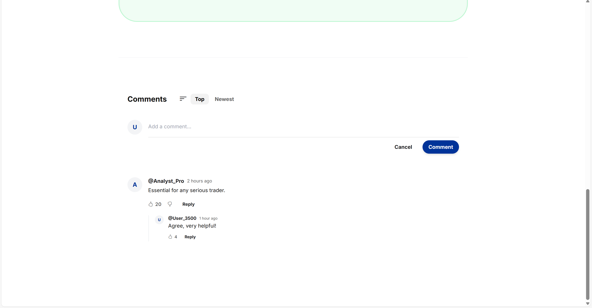
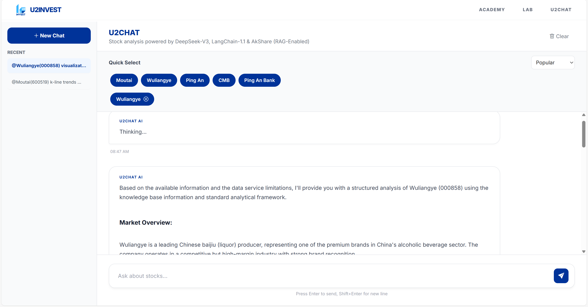

# U2INVEST User Guide 📘

**Your path, Your Choice, Your Future, You to Invest.**

Welcome to the complete walkthrough of the U2INVEST platform. This guide demonstrates every feature of our comprehensive financial education and analysis system.

---

##  1. Landing Page & Navigation
Your gateway to financial literacy. The clean interface allows you to jump straight into one of our three core pillars.

*   **Academy:** For structured learning.
*   **Lab:** For risk-free practice.
*   **U2CHAT:** For AI-assisted analysis.

---

##  2. Knowledge Academy
The Academy is designed to take you from novice to pro through structured coursework.

### 2.1 Core Features
The main dashboard offers two views: **Course Modules** (Grid View) and **Learning Roadmap** (Tree View). You can track your progress and difficulty levels at a glance.

### 2.2 Learning Roadmap (Visual Progression)
We use a D3.js interactive tree to visualize your learning path.
*   **Standard Mode:** Follow our curated path from "Foundations" (Blue) to "Advanced" (Dark Blue) to "Professional" (Purple).
    

*   **Design By Yourself Mode:** Switch to "You to Design" to create your own mental map.
    
    *   **Add Concepts:** Create custom nodes for topics you want to study.
        
    *   **Link Nodes:** Connect ideas to build your own knowledge graph.
        

### 2.3 Module Interface
Clicking any topic opens the learning module.
*   **Video Lessons:** High-quality content curated from top financial educators.
    
*   **Community:** Discuss topics with other learners.
    
*   **Progress Tracking:** Mark lessons as complete to earn your badge.
    
*   **Share:** Share your progress on social media.
    

---

##  3. Trading Lab
Before risking real money, master the market here with **$100,000 virtual cash**.

### 3.1 Beginner Guide (Investment 101)
New to stocks? Our interactive guide walks you through the basics before you trade.
*   **Step 1: Ownership:** Understand what a stock actually is.
    
*   **Step 2: Risk:** Learn about diversification.
    
*   **Step 3: Execution:** How to read the dashboard.
    
*   **Buy/Sell Guide:** Clear instructions on placing orders.
    

### 3.2 Professional Dashboard (The Lab)
For advanced users, the Lab offers a professional trading interface.
*   **Real-time Data:** Live prices for A-share stocks (Moutai, CATL, etc.).
*   **Interactive Charts:** Zoomable K-Line charts (60/120/250 days).
*   **Order Entry:** Buy and Sell instantly.
*   **Portfolio Tracking:** Monitor your Cash, Holdings, and Returns in real-time.

---

##  4. U2CHAT (AI Agent)
Your 24/7 Financial Analyst, powered by **DeepSeek-V3** and **LangGraph**.

### 4.1 Advanced Reasoning
Unlike basic bots, U2CHAT "thinks" before it answers. It breaks down complex queries into logical steps.

### 4.2 Market Analysis
Ask about any stock (e.g., "Analyze Moutai"). The agent fetches real-time data and provides a professional breakdown.

### 4.3 Data Visualization
The agent doesn't just talk; it draws. It generates interactive price charts right in the chat window.

### 4.4 Strategic Suggestions
It can combine real-time data with its internal knowledge base (RAG) to offer investment strategies.

---

##  Architecture
For the tech-savvy, here is how U2INVEST works under the hood:

