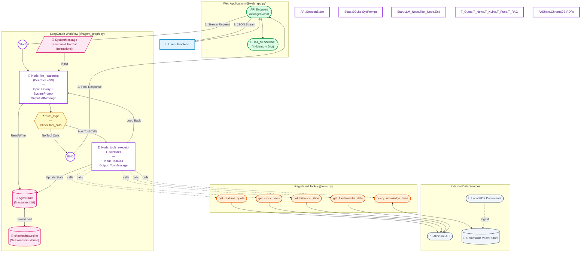

```mermaid
---
config:
  layout: fixed
---
flowchart TB

 %% ==========================================
 %% 1. Web Application Layer
 %% ==========================================
 subgraph WebApp["Web Application (@web_app.py)"]
    direction TB
        API(["API Endpoint<br>/api/agent/chat"])
        SessionStore(["CHAT_SESSIONS<br>(In-Memory Dict)"])
  end

 %% ==========================================
 %% 2. LangGraph Engine
 %% ==========================================
 subgraph LangGraph["LangGraph Workflow (@agent_graph.py)"]
    direction TB
        
        %% Data & Persistence
        State[("📝 AgentState<br>(Messages List)")]
        SQLite[("💾 checkpoints.sqlite<br>(Session Persistence)")]

        %% Flow Nodes
        Start(("Start"))
        
        LLM_Node["🤖 Node: llm_reasoning<br>(DeepSeek-V3)<br>---<br>Input: History + SystemPrompt<br>Output: AIMessage"]
        
        Router{{"❓ route_logic<br>---<br>Check tool_calls"}}
        
        Tool_Node["🛠️ Node: tools_executor<br>(ToolNode)<br>---<br>Input: ToolCall<br>Output: ToolMessage"]
        
        End(("END"))

        %% System Persona
        SysPrompt[/"📄 SystemMessage<br>(Persona & Format Instructions)"/]
  end

 %% ==========================================
 %% 3. Tool Definitions
 %% ==========================================
 subgraph ToolKit["Registered Tools (@tools.py)"]
    direction TB
        T_Quote(["get_realtime_quote"])
        T_News(["get_stock_news"])
        T_KLine(["get_historical_kline"])
        T_Fund(["get_fundamental_data"])
        T_RAG(["query_knowledge_base"])
  end

 %% ==========================================
 %% 4. External Systems
 %% ==========================================
 subgraph External["External Data Sources"]
        AkShare(["📉 AkShare API"])
        ChromaDB[("🧠 ChromaDB Vector Store")]
        PDFs(["📂 Local PDF Documents"])
  end

    %% --- Connections ---

    %% Web App Flow
    User["👤 User / Frontend"] --> API
    API <--> SessionStore
    API -->|1. Stream Request| Start

    %% LangGraph Flow
    Start --> LLM_Node
    SysPrompt -. Inject .-> LLM_Node
    
    LLM_Node -->|Read/Write| State
    LLM_Node --> Router

    Router -- Has Tool Calls --> Tool_Node
    Router -- No Tool Calls --> End

    Tool_Node -->|Update State| State
    Tool_Node -->|Loop Back| LLM_Node

    %% Persistence
    State <-->|Save/Load| SQLite

    %% Tool Execution (Dotted lines for function calls)
    Tool_Node -. calls .-> T_Quote
    Tool_Node -. calls .-> T_News
    Tool_Node -. calls .-> T_KLine
    Tool_Node -. calls .-> T_Fund
    Tool_Node -. calls .-> T_RAG

    %% External Data Fetching
    T_Quote --> AkShare
    T_News --> AkShare
    T_KLine --> AkShare
    T_Fund --> AkShare
    T_RAG <--> ChromaDB
    PDFs -. Ingest .-> ChromaDB

    %% Final Output
    End -->|2. Final Response| API
    API -->|3. JSON Stream| User

    %% --- Styling ---
     classDef client fill:#e0f2fe,stroke:#0284c7,stroke-width:2px,color:#0c4a6e
     classDef flask fill:#dcfce7,stroke:#16a34a,stroke-width:2px,color:#14532d
     classDef node fill:#ffffff,stroke:#9333ea,stroke-width:3px,color:#581c87
     classDef logic fill:#fef9c3,stroke:#d97706,stroke-width:2px,color:#78350f,shape:rhombus
     classDef tool fill:#ffedd5,stroke:#ea580c,stroke-width:2px,color:#7c2d12
     classDef external fill:#f1f5f9,stroke:#64748b,stroke-width:2px,color:#334155
     classDef storage fill:#fce7f3,stroke:#db2777,stroke-width:2px,color:#831843

     %% Apply Classes
     User:::client
     API,SessionStore:::flask
     State,SQLite,SysPrompt:::storage
     Start,LLM_Node,Tool_Node,End:::node
     Router:::logic
     T_Quote,T_News,T_KLine,T_Fund,T_RAG:::tool
     AkShare,ChromaDB,PDFs:::external
```